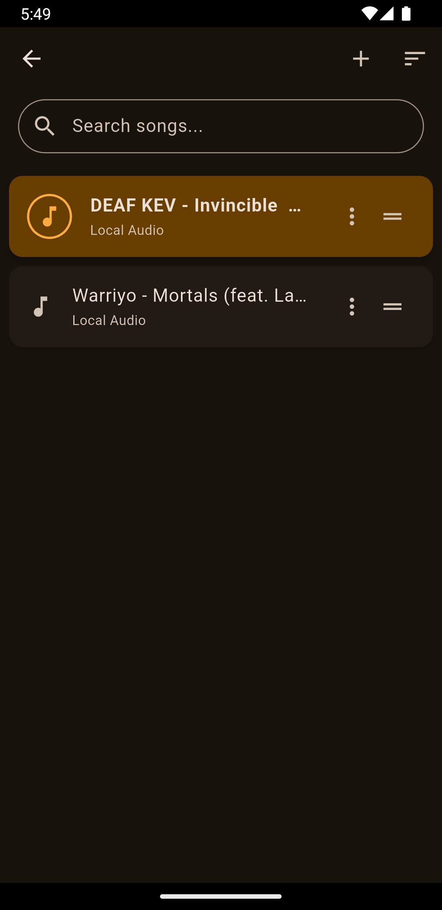
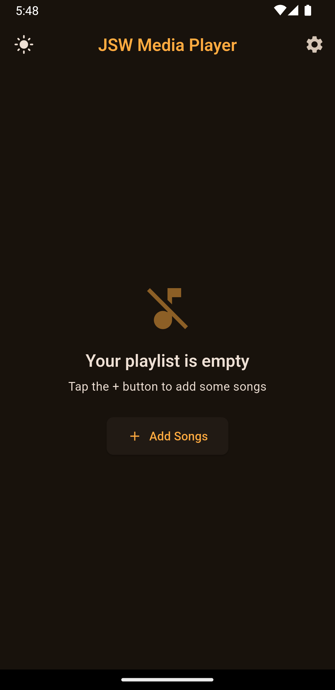
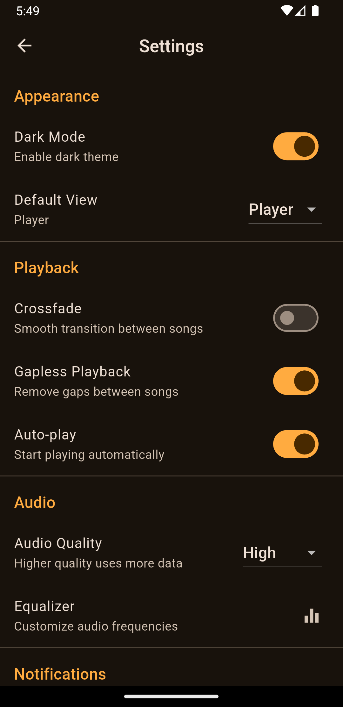

# JSW Media Player

A modern and feature-rich media player application built with Flutter, offering a seamless music playback experience with an intuitive user interface and dynamic theming capabilities.

## Features

### Core Features
- 🎵 Clean and intuitive user interface
- ⏯️ Music playback controls (play, pause, skip, seek)
- 📝 Playlist management with drag-and-drop support
- 📱 Responsive design for various screen sizes

### Advanced Features
- 🌓 Dynamic theme switching (Light/Dark mode)
- ✨ Smooth animations and transitions
- 📊 State management using Provider
- 🔄 Custom slide page transitions

## Screenshots

### Player Interface
<div style="display: flex; justify-content: space-between;">
  
  
  
  
</div>


## Getting Started

### Prerequisites

- Flutter SDK (latest version)
- Dart SDK (latest version)
- Android Studio / VS Code with Flutter extensions

### Installation

1. Clone the repository:
   ```bash
   git clone https://github.com/ibrahimsezer/mediaplayer.git
   ```

2. Navigate to the project directory:
   ```bash
   cd mediaplayer
   ```

3. Install dependencies:
   ```bash
   flutter pub get
   ```

4. Run the application:
   ```bash
   flutter run
   ```

## Project Structure

```
lib/
├── assets/        # Contains images and other static assets
├── const/         # Constants and configuration files
├── helper/        # Helper functions and utilities
├── theme/         # Theme configuration and providers
├── view/          # UI screens and widgets
├── viewmodel/     # Business logic and state management
└── main.dart      # Application entry point
```

### Key Components

#### Theme System
Located in `lib/theme/`
- `app_theme.dart`: Defines the application's theme data
- `theme_provider.dart`: Manages theme state using Provider

#### Media Player
Located in `lib/view/`
- `media_player_view.dart`: Main player interface
- `media_player_control_widget.dart`: Playback controls
- `playlist_view.dart`: Playlist management interface

#### State Management
Located in `lib/viewmodel/`
- `media_player_viewmodel.dart`: Handles media player state and logic

## Features in Detail

### 🎨 Theme Switching
- Seamless switching between light and dark modes
- Custom color schemes for both themes
- Persistent theme preference

### 🎵 Audio Playback
- Support for multiple audio formats
- Background playback capability
- Queue management and playlist features

### 📱 User Interface
- Modern and clean design
- Intuitive controls and gestures
- Responsive layout for all screen sizes

## Contributing

Contributions are welcome! Please feel free to submit a Pull Request. Here's how you can contribute:

1. Fork the repository
2. Create your feature branch (`git checkout -b feature/AmazingFeature`)
3. Commit your changes (`git commit -m 'Add some AmazingFeature'`)
4. Push to the branch (`git push origin feature/AmazingFeature`)
5. Open a Pull Request

## License

This project is licensed under the MIT License - see the [LICENSE](LICENSE) file for details.

## Acknowledgments

- Flutter team for the amazing framework
- All contributors who participate in this project
- Open source community for inspiration and support

---
Made with ❤️ by Ibrahim Sezer
